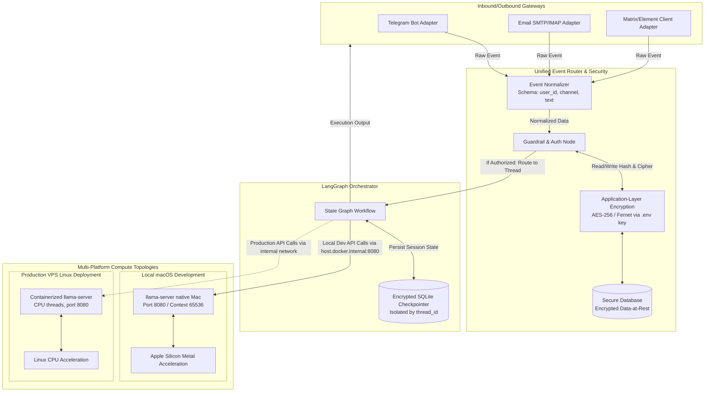

# ChannelAgent Architecture

This is a living description of the system: components, deployment
topology per platform, and data flow. It is updated in the same change
as any architectural decision, not as a follow-up.

## Origin and goal

ChannelAgent replaces the Hermes Agent orchestrator (a deployment built
on the third-party `nousresearch/hermes-agent` Docker image, see
[Audit of the legacy Hermes project](#audit-of-the-legacy-hermes-project)
below) with an independent, 100% local, multi-user, multi-channel
agentic system built on LangGraph and packaged as a Linux Docker
container.

The central change from the legacy system: user authorization moves
from static `ALLOWED_USERS` environment variables to a proper database
and API layer, enabling per-user permissions, multiple administrators,
and runtime user management without editing `.env` and restarting the
service.

## System diagram



## Components

### Channel adapters

Each adapter (Telegram, Email, Matrix/Element) is responsible only for
transport: receiving a raw platform-specific message and normalizing it
into the standard event schema before handing it to the router. Adapters
do not implement authorization or business logic themselves.

Normalized event schema:

```
{
  "user_id": str,     # platform-specific identifier (Telegram user id,
                       # email address, Matrix user id)
  "channel": str,     # "telegram" | "email" | "matrix"
  "text": str          # message content
}
```

### Email on a shared mailbox

The mailbox used by the Email adapter, `contact@codefixture.com`, is
shared. The website uses it to receive contact and information
requests, and the bot uses it to talk to its users. The adapter has to
tell an ordinary customer mail from a message meant for the bot, and it
must never disturb the ordinary ones.

**Rule (subject tag).** The adapter only handles messages whose subject
contains `EMAIL_TRIGGER_TAG` (default `[agent]`, case-insensitive, ASCII
only). A reply keeps the tag because the adapter answers with
`Re: <original subject>`, so a conversation continues without retyping
it.

| Incoming message | What the adapter does |
|---|---|
| No tag in the subject | Nothing. Not fetched, not flagged, not answered. It stays unread for a human. |
| Tag, sender authorized | Read without flagging it, routed to the agent, reply sent, **then** marked Seen and filed into `EMAIL_AGENT_FOLDER`. If the turn fails it stays unread and is tried again on the next poll, up to 3 attempts, then it is marked Seen and filed into `<EMAIL_AGENT_FOLDER>.Failed`. No apology email is ever sent. |
| Tag, sender unknown | An `AccessRequest` is created for the admin, no reply is sent, then it is marked Seen and filed into `EMAIL_AGENT_FOLDER`. Not retried. |

How the guarantees are enforced (`app/channels/email.py`):

- The server-side `SEARCH UNSEEN SUBJECT "<tag>"` narrows the set, and
  the subject is checked again in the adapter because IMAP servers
  differ in how they match `SUBJECT`.
- Messages are fetched with `BODY.PEEK[]`, which sets no flag. Only a
  tagged message that has been **handled** is marked `\Seen` and filed
  (#51): a failed turn leaves it unread for another attempt. A plain
  `RFC822` fetch marks the message as read on most servers, which is what
  hid customer mail from humans before this rule existed.
- Retries (#51): a failed turn is counted per message in memory, so a
  restart gives a message a fresh set of 3 attempts. The inbound entry is
  written once, not once per attempt. A message that fails 3 times is
  marked Seen and filed into `<EMAIL_AGENT_FOLDER>.Failed` (only marked
  Seen when `EMAIL_AGENT_FOLDER` is empty), and each failure has an audit
  entry with status `failed`. One message that raises does not stop the
  others in the same poll.
- An empty tag, or one with non-ASCII characters, quotes or backslashes,
  is refused: the adapter does not start. An empty tag never means
  "process everything".
- A handled message leaves the `INBOX` that humans read: it is moved to
  `EMAIL_AGENT_FOLDER` (default `INBOX.Agent`, the OVH/Dovecot layout with
  `.` as separator; created and subscribed on first use; empty value =
  leave it in the `INBOX`). Everything is addressed by IMAP UID, not by
  message number, because a move renumbers the messages after it. The
  move uses `UID MOVE` when the server and `imaplib` both support it,
  otherwise `UID COPY` + `\Deleted` + `UID EXPUNGE` (needs `UIDPLUS`),
  otherwise nothing is moved. A plain `EXPUNGE` is never sent, because it
  would also remove messages a human client flagged Deleted but has not
  expunged. A failed move is logged and never blocks the message from
  being handled. **Nothing is deleted or purged automatically**: this was
  an explicit decision (2026-09-20), messages are moved, never removed.
- Unknown senders get no reply on email (`SILENT_DENIAL_CHANNELS` in
  `app/channels/dispatch.py`). An email `From` address can be forged, so
  answering it would send mail to a third party.

**What email can do today.** A conversation with the user's default
agent. Creating or editing agents is done from the admin console
(`./start.sh --admin`) or the Admin API, not by sending a command by
mail: no message parsing for commands exists yet.

**The tag is a routing convention, not a security boundary.** Anyone can
type it. Access control is still the Auth Node: a tagged message from an
unknown sender only creates a pending request.

Tracking: the tag rule is [#43](https://github.com/ka8t/ChannelAgent/issues/43),
the folder is [#44](https://github.com/ka8t/ChannelAgent/issues/44).

**Future evolution
([#42](https://github.com/ka8t/ChannelAgent/issues/42)).** Give the bot
its own dedicated address, used only by the Email adapter. The tag is
then no longer needed to protect ordinary mail, and can be removed or
kept as an optional extra filter. This only needs the `EMAIL_*`
variables to point at the new mailbox, plus the decision about the tag.

### Event Normalizer and Auth Node

The Event Normalizer converts each channel's raw payload into the
schema above. The Auth Node then queries the database (through the
encryption layer) to check whether the `(channel, user_id)` pair is a
known, active, authorized user, and what permissions they hold. This
replaces the legacy `ALLOWED_USERS` static string check with a runtime
database lookup, allowing users and permissions to be added, revoked,
or scoped without restarting the container.

### Roles and permissions

A `User` (platform-independent) has one `ChannelIdentity` per
`(channel, external_id)` it's known by. `Permission` is a separate
table, not a column: each row is `(channel_identity_id, kind)` with
`kind` one of `chat` (may talk to the agent) or `admin` (may also
manage other users through the Admin API — see below). Granting is
inserting a row, revoking is deleting one; there is no third "no
permission" state to reconcile.

Permissions are scoped to the `ChannelIdentity`, not the `User` —
the same person can hold `admin` on their Telegram identity while
their Email identity only has `chat`, or none at all. The Auth Node's
decision (`app/security/auth.py::authorize`) is always evaluated
against the specific `(channel, user_id)` pair a message arrived on,
never against the user's permissions on other channels.

### Application-layer encryption

Sensitive fields (raw email addresses, Matrix access tokens, other
personal metadata) are encrypted before being written to the database
and decrypted after being read, using symmetric encryption
(`cryptography`'s Fernet, AES-128-CBC + HMAC under the hood). The
encryption key is loaded at runtime from `.env` (`ENCRYPTION_KEY`) and
is never stored in the database and never committed to Git. See
`app/security/encryption.py`.

### Admin API and console over one service layer

Every administrative operation exists once, in `app/admin/service.py`. The
Admin API routes (`app/api/routes.py`) and the console
(`./start.sh --admin`, `app/admin/cli.py`) only call it: neither holds a
query of its own (#35, #41). Service errors are typed and each front end
maps them: `NotFoundError` is HTTP 404, `ConflictError` 409,
`InvalidInputError` 422 (handlers in `app/api/app.py`); the console prints
the message and returns to its menu.

| Area | Admin API | Console menu |
|---|---|---|
| Users | `POST/GET /users`, `GET/PATCH/DELETE /users/{id}` (`?purge=true`) | 2: detail, create, activate, deactivate, delete |
| Channel identities | `POST/GET /users/{id}/channels`, `DELETE .../channels/{id}` | 2: add-identity, remove-identity |
| Permissions | `POST/GET/DELETE .../channels/{id}/permissions[/{kind}]` | 2: grant, revoke |
| Access requests (#36) | `GET /requests?status=pending\|approved\|denied\|all`, `POST /requests/{id}/approve`, `POST /requests/{id}/deny` | 1 |
| Agents (#37) | `GET/POST /users/{id}/agents`, `GET/PATCH /agents/{id}` (rename, activate, deactivate, any user's) | 3 |
| Audit trail | `GET /logs` | 4 |
| Storage | `GET /storage` | 5 |

- **Access requests.** Approving creates the user, the channel identity and
  the `chat` permission in one step. If the identity already exists (an admin
  added it by hand after the request), it is granted `chat` and no second
  user is created. Resolving records who did it in `resolved_by`: `api` or
  `console` (there is one shared key and no admin identity). A request that is
  already resolved answers 409, an unknown one 404.
- **Agents.** Names are unique per user (409), 1 to 100 characters (422). A
  **deactivated agent does not answer**: the user gets a fixed notice, the
  message is recorded with status `denied` and the LLM is not called. Which
  agent a message reaches is not selectable yet
  ([#54](https://github.com/ka8t/ChannelAgent/issues/54)).
- **Console.** Every menu is wrapped: a mistyped answer, an unknown id or a
  refused operation prints a message and returns to the menu; an unexpected
  error is logged and reported; closing the input ends the session cleanly.
  Deleting a user asks for the word `PURGE` to also delete their history.
- **Parity.** A test runs the same operation through the API on one database
  and through the console on an identical one, and compares the rows and the
  service functions called (13 operations).

### Admin API exposure

The Admin API serves user, permission and agent data and, since #39, the
**decrypted text of every conversation**, behind one static bearer key
over plain HTTP. It is therefore reachable from the local machine only
unless someone decides otherwise (#52).

| Where it runs | Default | How to change it |
|---|---|---|
| Native (`./start.sh --native`) | Binds to `127.0.0.1` | `API_SERVER_HOST` |
| Docker (`docker-compose.yml`) | Listens on `0.0.0.0` *inside* the container (`API_SERVER_HOST` is forced there, the published port could not reach it otherwise) and is published on `127.0.0.1` of the host | `API_BIND_ADDRESS` |

`API_SERVER_KEY` must be at least 16 characters, otherwise the API does
not start and logs why (`openssl rand -hex 32` is a good key).

**Administering from another machine.** Do not publish the port on the
network as it is: the key travels in a header, in clear. Either open an
SSH tunnel (`ssh -L 8700:127.0.0.1:8700 <host>`) or put a reverse proxy
that terminates TLS in front of it, on the same host, forwarding to the
loopback address. Only widen `API_BIND_ADDRESS` or `API_SERVER_HOST` when
a TLS proxy on another host has to reach it.

Verified on 2026-09-20, from the loopback address and from the machine's
own LAN address: default Docker publishing answers `401` (no key) and
`200` (key) on loopback and refuses the connection on the LAN address;
with `API_BIND_ADDRESS=0.0.0.0` the LAN address answers `401`. The native
run behaves the same (`127.0.0.1:port` by default, `*:port` when
`API_SERVER_HOST=0.0.0.0`).

### Audit trail and log search

Every inbound and outbound message is recorded in `action_logs`, tied to
a user, an agent and a channel, with its text encrypted (same class of
data as an email address). Searching it (#39) goes through **one**
function, `app.admin.service.search_action_logs`, called by both front
ends: `GET /logs` on the Admin API and menu 4 of the console
(`./start.sh --admin`). Neither holds query logic of its own.

| Filter | Meaning |
|---|---|
| `user_id`, `agent_id`, `channel`, `direction`, `status` | Exact match. `status` is `ok`, `failed` or `denied`. |
| `since` / `until` | Half-open window: `since` inclusive, `until` exclusive. A naive datetime is UTC, an aware one is converted to UTC. The console reads dates as `YYYY-MM-DD` (UTC) and treats a "to" date as that whole day. |
| `keyword` | Case-insensitive substring of the **decrypted** text. |
| `limit`, `offset` | 1 to 500 results (default 100 on the API, 20 in the console); `offset` skips that many *matching* rows. |

All filters are optional and combine with AND. Results are most recent
first.

**Why the keyword is matched in Python.** Fernet output differs on every
write, so the ciphertext cannot be searched or compared in SQL. The
other filters run in SQL, then the keyword is checked on each candidate
row after decryption, newest first, stopping as soon as `limit` matches
are found. That is O(n) in the number of rows left by the other filters,
which is fine for a single user or a small group. No index is built on
purpose: narrow with user, agent, channel or dates first on a large log.

`GET /logs` returns the decrypted text, so it is only served behind the
`API_SERVER_KEY` bearer check like every other route.

### Failed turns

`app.channels.dispatch.dispatch_event` never lets a failure escape (#51)
and returns a `DispatchOutcome` (`ok`, `denied` or `failed`) so the
adapter can decide about retrying.

1. The inbound message is committed to the audit trail **before** the LLM
   is called, so a failed turn cannot lose it.
2. If the LLM call raises (gateway down, timeout), the error is logged
   with its traceback, the user gets one fixed apology (`Sorry, I cannot
   answer right now...`, never an error text), and an outbound entry with
   status `failed` is recorded. With `apologize=False` (email retries
   silently) nothing is sent and the entry says so.
3. If delivering the answer fails, the generated answer is kept in an
   outbound entry with status `failed`, so it is not lost.
4. A known identity without permission is recorded as an inbound entry
   with status `denied`; an unknown identity has no user to attach a log
   to and only gets an `AccessRequest`.

`status` is a column of `action_logs` (Alembic migration `bcf3aa387f5e`,
existing rows are `ok`) and can be filtered in `GET /logs` and in the
console. Known limit: when the answer was generated but the reply could
not be delivered, an email retry runs the turn again and the
conversation history gains a duplicate turn.

### Storage overview

`GET /storage` on the Admin API and menu 5 of the console (#40) call one
function, `app.admin.service.storage_overview`. It reports the size of
the SQLite file (the main database file only, nothing for a database that
is not a SQLite file), the exact `COUNT(*)` of every table (`users`,
`channel_identities`, `permissions`, `access_requests`, `agents`,
`action_logs`) and the oldest and newest audit-trail timestamps in UTC
(none while the log is empty). The API leaves the file path out on
purpose. This is visibility, not a storage engine or a backup tool.

### Referential integrity and deleting users

SQLite ignores foreign keys unless every connection asks for them, so the
application's engine sets `PRAGMA foreign_keys=ON` on each connection
(#50). Alembic's own engine does not: SQLite's copy-and-move rebuild used
by batch migrations is not meant to run with enforcement on. The service
layer also checks that a user exists before creating an agent for them,
so the caller gets a clear `UserNotFoundError` instead of a database
error.

**Deleting a user** (`app.admin.service.delete_user`, `DELETE
/users/{id}`):

| The user has | Default | With `purge` (`?purge=true`) |
|---|---|---|
| No audit-trail entries | Deleted with their agents, channel identities and permissions | Same |
| Audit-trail entries | **Refused** (`409` with the counts): deactivate the user instead | Agents, log entries, identities and permissions are all deleted in one transaction |

The audit trail is the point of the action log, and the normal way to
stop someone is to deactivate them, so deleting is the exception. The
purge exists for a privacy request. Nothing persists unless the caller
commits.

### Database and migrations

SQLite via SQLAlchemy (async, `aiosqlite`) — matches the "100% local"
requirement with zero extra infrastructure. `DATABASE_URL` in `.env`
is the only thing that would change to move to Postgres later.

Schema changes are tracked with [Alembic](https://alembic.sqlalchemy.org/)
(`alembic/versions/`), not `Base.metadata.create_all` — `init_db()`
(`app/db/session.py`) runs `alembic upgrade head` at every startup, so
a schema change never requires dropping the database. See `README.md`'s
"Database migrations" section for the day-to-day workflow.

### LangGraph orchestrator

A single `StateGraph` workflow (`app/graph.py`) handles agent reasoning
for every channel. Per-user, per-conversation isolation is achieved
through LangGraph's native checkpointer, keyed by a `thread_id` built from
the channel, the identity key and the agent:

- `telegram_{user_id}_{agent_id}`
- `email_{email_hash}_{agent_id}` (hash, not the raw address, used as the
  thread key: the raw address itself is only ever handled encrypted at rest)
- `matrix_{user_id}_{agent_id}`

**Conversations survive a restart** (#49). The checkpoints live in a
SQLite file of their own, `checkpoints.db` next to the main database
(`CHECKPOINT_DB_PATH` to move it), so it is in the volume Docker keeps.
Alembic keeps owning only the application's tables; the checkpointer
creates its own. The payloads are **encrypted with `ENCRYPTION_KEY`**
(Fernet, through LangGraph's `EncryptedSerializer`), like `ActionLog.text`,
because a checkpoint is the whole conversation. Only the thread id and
the checkpoint ids stay readable.

- The file is in WAL mode: while the application runs, recent writes are
  in `checkpoints.db-wal`. A backup must copy `checkpoints.db`,
  `checkpoints.db-wal` and `checkpoints.db-shm` together, or use SQLite's
  backup command.
- With a different or lost `ENCRYPTION_KEY`, the next turn on an existing
  thread raises (the turn is recorded as failed, see "Failed turns"), and
  the other threads are not affected.
- Purging a user (`DELETE /users/{id}?purge=true`) deletes their
  conversation threads too.
- The history is not trimmed yet: a very long thread will eventually
  exceed the model's context window ([#47](https://github.com/ka8t/ChannelAgent/issues/47)).

### Compute topology

- **Local macOS development**: a native `llama-server` process runs
  directly on the Mac host (Metal acceleration), listening on port
  8080 with a 65536-token context. The Linux Docker container reaches
  it via `host.docker.internal:8080`, not `localhost`.
- **Production VPS**: a containerized `llama-server` (same binary, same
  flags as the Mac's — no `-ngl` GPU offload, CPU threads instead)
  serves inference over the internal Docker network, port 8080. See
  `docker-compose.prod.yml` and `docker/llama-server.Dockerfile`
  (#21). **Decided over Ollama/vLLM**, this diagram's original
  design, after auditing the legacy Hermes project's own production
  setup: Hermes previously ran `llama-swap` in front of `llama-server`
  for a "swap models at runtime" feature this project never uses, and
  `llama-swap`'s own separate, untracked update lifecycle let its VPS
  silently run a two-week-stale `llama-server` through a real
  incident. A single always-loaded model, containerized directly,
  needs none of that — and keeps the exact same OpenAI-compatible
  endpoint shape `app/graph.py` already talks to on the Mac, so dev and
  prod run identical inference code paths, not two.

The application code that calls the LLM gateway does not need to know
which topology it is running against — only the base URL
(`LLAMA_SERVER_URL`) changes between environments.

## Audit of the legacy Hermes project

Source directory audited: `/Users/mac/Documents/Code/Hermes`.

**Finding: there is no reusable database or API server source code to
port over.** The Hermes repository is a deployment and provisioning
wrapper around a third-party, closed-source base image
(`FROM nousresearch/hermes-agent:latest` in `docker/Dockerfile`), not a
project that contains its own server implementation. Concretely:

- No SQL files, migrations, or ORM schema definitions (Prisma,
  SQLAlchemy, or otherwise) exist anywhere in the repository. The only
  schema-adjacent file is `docker/patch-web-search-schema.py`, a
  build-time monkey-patch of a JSON-schema tool contract inside the
  vendored image — unrelated to a user/permissions database.
- The runtime SQLite files present (`state.db`, `kanban.db`,
  `runs_idempotency.db`, `response_store.db`, found under
  `macos-arm64/data/`) are created and owned by the vendored
  `hermes-agent` binary at runtime. Their schemas are not defined in
  this repository's source and are not safe or meaningful to copy —
  they belong to a different, closed application.
- **No API server source code exists for port 8645.** The `.env` files
  (`macos-arm64/.env`, `linux-x86_64-vps/.env.example`) only *configure*
  a port (`API_SERVER_PORT=8645`, `API_SERVER_ENABLED=true`,
  `HERMES_DASHBOARD=1`) for a dashboard/API component that ships inside
  the vendored `nousresearch/hermes-agent` image. There is no routing
  logic, endpoint definitions, or request handlers checked into this
  repository to analyze or reuse.
- **The `ALLOWED_USERS` mechanism is confirmed to be exactly what it was
  described as**: static environment variables per channel
  (`TELEGRAM_ALLOWED_USERS`, `EMAIL_ALLOWED_USERS`), read directly from
  `.env` by provisioning scripts (`configure-telegram.sh`,
  `configure-email.sh`, `provision-user.sh`) and documented in
  `shared/multi-user-agents.md`. There is no database-backed user table
  anywhere in the legacy repository — confirming this is a real gap
  ChannelAgent's database/API layer is designed to close, not a
  migration of an existing mechanism.

**Security note**: `macos-arm64/.env` (a real, non-example environment
file) contains a live `API_SERVER_KEY` value and a dashboard basic-auth
password. Neither was copied into this repository. If that key or
password needs to be reused or rotated, do so manually and outside of
version control.

**Practical consequence for this project**: the database schema
(users, channels, permissions, encrypted fields) and the admin API
described in this document are designed from scratch for ChannelAgent.
Nothing from Hermes is ported at the code level; only the operational
knowledge audited above (the `host.docker.internal:8080` local LLM
path, the channel set to support, and the static-`ALLOWED_USERS`
problem being solved) carries over.

## Status

- [x] Git repository initialized, `.gitignore` protecting `.env` and
      local databases.
- [x] Encryption helper placeholder (`app/security/encryption.py`) and
      settings loader (`app/config.py`).
- [ ] Everything else is tracked as GitHub issues on
      [`ka8t/ChannelAgent`](https://github.com/ka8t/ChannelAgent/issues),
      organized as 7 epics, one per section of this document:
      [#1 Encrypted database & models](https://github.com/ka8t/ChannelAgent/issues/1),
      [#2 Database-backed authorization](https://github.com/ka8t/ChannelAgent/issues/2),
      [#3 LangGraph orchestrator & state isolation](https://github.com/ka8t/ChannelAgent/issues/3),
      [#4 Containerization & deployment topology](https://github.com/ka8t/ChannelAgent/issues/4),
      [#5 Admin API](https://github.com/ka8t/ChannelAgent/issues/5),
      [#6 Channel adapters](https://github.com/ka8t/ChannelAgent/issues/6),
      [#7 Testing & CI](https://github.com/ka8t/ChannelAgent/issues/7).
      Each epic links its own implementation issues, labeled by
      priority (`P0-critical` .. `P3-low`) and area
      (`area:database`, `area:security`, `area:api`, `area:channels`,
      `area:langgraph`, `area:docker`, `area:testing`).
