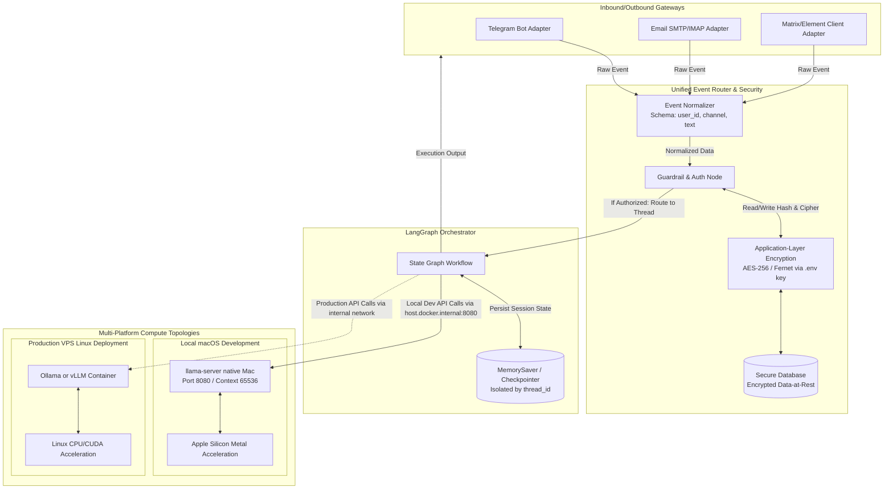

# ChannelAgent Architecture

This is a living description of the system: components, deployment
topology per platform, and data flow. It is updated in the same change
as any architectural decision, not as a follow-up.

## Origin and goal

ChannelAgent replaces the Hermes Agent orchestrator (a deployment built
on the third-party `nousresearch/hermes-agent` Docker image, see
[Audit of the legacy Hermes project](#audit-of-the-legacy-hermes-project)
below) with an independent, 100% local, multi-user, multi-channel
agentic system built on LangGraph and packaged as a Linux Docker
container.

The central change from the legacy system: user authorization moves
from static `ALLOWED_USERS` environment variables to a proper database
and API layer, enabling per-user permissions, multiple administrators,
and runtime user management without editing `.env` and restarting the
service.

## System diagram



## Components

### Channel adapters

Each adapter (Telegram, Email, Matrix/Element) is responsible only for
transport: receiving a raw platform-specific message and normalizing it
into the standard event schema before handing it to the router. Adapters
do not implement authorization or business logic themselves.

Normalized event schema:

```
{
  "user_id": str,     # platform-specific identifier (Telegram user id,
                       # email address, Matrix user id)
  "channel": str,     # "telegram" | "email" | "matrix"
  "text": str          # message content
}
```

### Event Normalizer and Auth Node

The Event Normalizer converts each channel's raw payload into the
schema above. The Auth Node then queries the database (through the
encryption layer) to check whether the `(channel, user_id)` pair is a
known, active, authorized user, and what permissions they hold. This
replaces the legacy `ALLOWED_USERS` static string check with a runtime
database lookup, allowing users and permissions to be added, revoked,
or scoped without restarting the container.

### Application-layer encryption

Sensitive fields (raw email addresses, Matrix access tokens, other
personal metadata) are encrypted before being written to the database
and decrypted after being read, using symmetric encryption
(`cryptography`'s Fernet, AES-128-CBC + HMAC under the hood). The
encryption key is loaded at runtime from `.env` (`ENCRYPTION_KEY`) and
is never stored in the database and never committed to Git. See
`app/security/encryption.py`.

### LangGraph orchestrator

A single `StateGraph` workflow (`app/graph.py`, to be implemented)
handles agent reasoning and tool use for every channel. Per-user,
per-conversation isolation is achieved through LangGraph's native
checkpointer mechanism, keyed by a `thread_id` derived from the channel
and user identity, e.g.:

- `telegram_{user_id}`
- `email_{email_hash}` (hash, not the raw address, used as the thread
  key — the raw address itself is only ever handled encrypted at rest)
- `matrix_{user_id}`

### Compute topology

- **Local macOS development**: a native `llama-server` process runs
  directly on the Mac host (Metal acceleration), listening on port
  8080 with a 65536-token context. The Linux Docker container reaches
  it via `host.docker.internal:8080`, not `localhost`.
- **Production VPS**: an Ollama or vLLM container serves inference over
  the internal Docker network, running on Linux CPU/CUDA acceleration
  instead of the Mac-only `llama-server` binary.

The application code that calls the LLM gateway does not need to know
which topology it is running against — only the base URL
(`LLAMA_SERVER_URL`) changes between environments.

## Audit of the legacy Hermes project

Source directory audited: `/Users/mac/Documents/Code/Hermes`.

**Finding: there is no reusable database or API server source code to
port over.** The Hermes repository is a deployment and provisioning
wrapper around a third-party, closed-source base image
(`FROM nousresearch/hermes-agent:latest` in `docker/Dockerfile`), not a
project that contains its own server implementation. Concretely:

- No SQL files, migrations, or ORM schema definitions (Prisma,
  SQLAlchemy, or otherwise) exist anywhere in the repository. The only
  schema-adjacent file is `docker/patch-web-search-schema.py`, a
  build-time monkey-patch of a JSON-schema tool contract inside the
  vendored image — unrelated to a user/permissions database.
- The runtime SQLite files present (`state.db`, `kanban.db`,
  `runs_idempotency.db`, `response_store.db`, found under
  `macos-arm64/data/`) are created and owned by the vendored
  `hermes-agent` binary at runtime. Their schemas are not defined in
  this repository's source and are not safe or meaningful to copy —
  they belong to a different, closed application.
- **No API server source code exists for port 8645.** The `.env` files
  (`macos-arm64/.env`, `linux-x86_64-vps/.env.example`) only *configure*
  a port (`API_SERVER_PORT=8645`, `API_SERVER_ENABLED=true`,
  `HERMES_DASHBOARD=1`) for a dashboard/API component that ships inside
  the vendored `nousresearch/hermes-agent` image. There is no routing
  logic, endpoint definitions, or request handlers checked into this
  repository to analyze or reuse.
- **The `ALLOWED_USERS` mechanism is confirmed to be exactly what it was
  described as**: static environment variables per channel
  (`TELEGRAM_ALLOWED_USERS`, `EMAIL_ALLOWED_USERS`), read directly from
  `.env` by provisioning scripts (`configure-telegram.sh`,
  `configure-email.sh`, `provision-user.sh`) and documented in
  `shared/multi-user-agents.md`. There is no database-backed user table
  anywhere in the legacy repository — confirming this is a real gap
  ChannelAgent's database/API layer is designed to close, not a
  migration of an existing mechanism.

**Security note**: `macos-arm64/.env` (a real, non-example environment
file) contains a live `API_SERVER_KEY` value and a dashboard basic-auth
password. Neither was copied into this repository. If that key or
password needs to be reused or rotated, do so manually and outside of
version control.

**Practical consequence for this project**: the database schema
(users, channels, permissions, encrypted fields) and the admin API
described in this document are designed from scratch for ChannelAgent.
Nothing from Hermes is ported at the code level; only the operational
knowledge audited above (the `host.docker.internal:8080` local LLM
path, the channel set to support, and the static-`ALLOWED_USERS`
problem being solved) carries over.

## Status

- [x] Git repository initialized, `.gitignore` protecting `.env` and
      local databases.
- [x] Encryption helper placeholder (`app/security/encryption.py`) and
      settings loader (`app/config.py`).
- [ ] Everything else is tracked as GitHub issues on
      [`ka8t/ChannelAgent`](https://github.com/ka8t/ChannelAgent/issues),
      organized as 7 epics, one per section of this document:
      [#1 Encrypted database & models](https://github.com/ka8t/ChannelAgent/issues/1),
      [#2 Database-backed authorization](https://github.com/ka8t/ChannelAgent/issues/2),
      [#3 LangGraph orchestrator & state isolation](https://github.com/ka8t/ChannelAgent/issues/3),
      [#4 Containerization & deployment topology](https://github.com/ka8t/ChannelAgent/issues/4),
      [#5 Admin API](https://github.com/ka8t/ChannelAgent/issues/5),
      [#6 Channel adapters](https://github.com/ka8t/ChannelAgent/issues/6),
      [#7 Testing & CI](https://github.com/ka8t/ChannelAgent/issues/7).
      Each epic links its own implementation issues, labeled by
      priority (`P0-critical` .. `P3-low`) and area
      (`area:database`, `area:security`, `area:api`, `area:channels`,
      `area:langgraph`, `area:docker`, `area:testing`).
