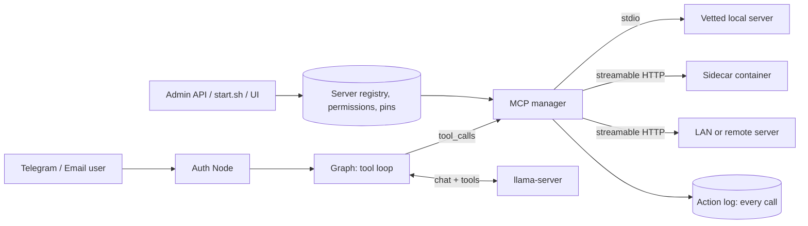

# Extending the agent with MCP servers and skills (proposal, 2026-09-21)

Owner requirement: the application must be extensible through MCP servers, to use external
tools and skills. It is mandatory, not optional. Status: design proposal for an epic, nothing here
is implemented. Companion documents: `docs/API_SECURITY.md` (the API every administrative
operation below goes through), `docs/COMPARISON_AJEAN.md` (A1, A2, A13).

## 1. What "extensible" means here

An administrator declares an MCP server (a program or a service that offers tools, and
optionally resources and prompts). From then on, agents that the administrator allows can call
its tools during a conversation on Telegram or email, for the users the administrator allows.
The application itself stays 100% local and independent: with zero MCP servers it works exactly as
today; every server is a plug-in the owner chooses, labelled by how far it can reach (local,
LAN, internet).

## 2. Measured starting point

- **The agent has no tools today.** `app/graph.py` is a plain chat loop against
  `llama-server`'s `/v1/chat/completions`.
- **Tool calling works on the installed model, but not with today's server flags.** Test on
  2026-09-21, `llama-server` build 10976, `Meta-Llama-3.1-8B-Instruct-Q4_K_M.gguf`, one request
  with one tool (`get_time`) at temperature 0:
  - with the flags `start.sh` uses now (`--jinja ... --skip-chat-parsing`): `tool_calls` empty,
    `finish_reason=stop`, the call comes back as text in `content`
    (`{"name": "get_time", "parameters": {"timezone": "Europe/Paris"}}`);
  - without `--skip-chat-parsing`: `tool_calls` filled with the function name and arguments,
    `finish_reason=tool_calls`.
  The flag is in `start.sh` and `docker-compose.prod.yml`; the repository records no reason for it
  (cause not established). Removing it is a prerequisite and its other effects are to be measured
  before the change.
- **One request is not a benchmark.** How reliably an 8B model picks the right tool among several
  is unmeasured; the epic's first issue measures it.
- **The runtime image** is `python:3.12-slim` (`Dockerfile`): Python servers can be installed,
  Node-based servers (`npx`) cannot run in it as it stands.
- **The Python MCP SDK** (`mcp`, latest 2.2.0 on 2026-09-21, 1.x also published) needs
  Python >= 3.10 and pulls in `anyio`, `httpx2`, `jsonschema`, `mcp-types`,
  `opentelemetry-api`, `pyjwt`, `python-multipart`, `sse-starlette`, `starlette`, `uvicorn` on top
  of what the project locks (#69). Which major version and whether `httpx2` is acceptable are
  to be checked at implementation; nothing was installed here.
- **AJEAN's reference** (`mcp_client.go`, `mcp_config.go`): stdio and HTTP transports; a
  configuration format identical to Claude Desktop's (`mcpServers`); tools named
  `mcp__<server>__<tool>`; per-server and per-tool enable switches; a connection test; tools given
  to the model only when agent mode is on. Its "skills" were folded into its memory pages before
  version 0.8 (`migrate_07.go`), so there is no skills mechanism to copy: what ChannelAgent means
  by skills is defined below.

## 3. Architecture

Components:

1. **Server registry** (database, administered only through the Admin API): name, transport,
   command and arguments or URL, environment variables (secrets in encrypted columns, like the
   other secrets), egress label (`local`, `lan`, `internet`), enabled flag, timeouts, allow and deny
   lists of tools, and the **pinned hash of the tool definitions** approved by the administrator.
2. **MCP manager**: lazy connection, idle stop, restart with backoff, health, concurrency limit
   per server, timeout and result-size cap per call. One failing server never stops the others
   (same principle as #83).
3. **Tool catalogue**: names `mcp__<server>__<tool>`; JSON schemas converted to the OpenAI
   `tools` format. Per agent, an allow-list of tools; a cap on how many tools one turn exposes
   (each definition costs prompt tokens and small models choose worse among many: the cap is
   measured, not guessed).
4. **Tool loop in the graph** (comparison items A1 and A2): rounds cap, identical-call guard,
   cancel with the turn, result truncated and labelled as data.
5. **Permissions**: a user reaches a tool only if granted (default deny), per agent and per server
   or tool. Tools whose MCP annotations say destructive or open-world (hints only, never trusted
   as security facts) get an administrator-set policy: `allow`, `confirm`, `deny`. `confirm` asks the
   user in the same channel (a Telegram button, an email reply) with a timeout, and the answer is
   audited.
6. **Audit**: each call is one row: user, agent, server, tool, redacted arguments, outcome, size,
   duration. Reads by an administrator follow the rules of `docs/API_SECURITY.md`.
7. **Skills** (owner: "outils/skills"). Two meanings, both supported:
   - **MCP prompts**: reusable prompt templates a server publishes, exposed as user commands.
   - **Local skills**: a folder with a `SKILL.md` (name, description, instructions, the tools it
     needs). Only names and descriptions go into the system prompt; the body is loaded by a
     `load_skill` tool when the model judges it relevant, so a hundred skills cost a few lines,
     not a hundred pages. Managed by administrators, versioned, granted per agent like tools.
8. **Administration** through the API of epic #106: server create, test (lists the tools), enable,
   per-tool switch, definition diff and approval, assignment to agents, grants, call history. The
   script (`start.sh --mcp ...`) and the UI are its two clients; nothing exists only in one.

## 4. Threats specific to MCP and how the design answers them

| Threat | Answer |
|---|---|
| A stdio server is arbitrary code running on the host | Only administrators declare servers, never users. Third-party servers run isolated (below). |
| A child process started by the application inherits its environment and files | The child gets a cleared environment (no `ENCRYPTION_KEY`, no bot token) and only its own declared variables. Same user and same filesystem still means it can read `data/`: this is why third-party stdio inside the application container is refused by default (decision M2). |
| Tool poisoning: a description that steers the model, or a description changed after approval | Definitions are hashed at approval; any change disables the tool until an administrator reviews the diff and re-approves. |
| Prompt injection through a tool result (a fetched page, a mail) | Results are size-capped and framed as untrusted data; a turn that read internet content and then reaches for a tool with write or internet reach requires confirmation. |
| Private data, untrusted content and an outbound channel in the same agent | The rule above; the admin UI shows each agent's combination so the owner sees it. |
| One credential in a server shared by several users (confused deputy) | A server holding a shared credential is flagged; it is granted only where the owner accepts that every granted user acts with it. Per-user credentials are out of scope for now. |
| Server-side request forgery through an HTTP server URL | HTTP servers are on an administrator allow-list of exact URLs; the outbound guard of `docs/API_SECURITY.md` 4.5 applies to everything else. |
| Secrets in prompts, logs, or server stderr | Environment values never enter prompts; the log redaction (#82) covers server output and arguments. |
| Runaway or slow server | Per-call timeout, result cap, concurrency cap, restart backoff, per-user rate limit. |
| Supply chain (a server or its dependency turns hostile) | Version pin, container images pinned by digest, the pin recorded in the registry and the audit trail. No automatic install from any registry. |
| Loss of independence | No default server, no auto-discovery, egress label visible everywhere, the core needs none. |

## 5. Where servers run (decision M2)

1. **Vetted built-in servers over stdio** inside the application image: small Python servers the
   project ships and tests (for example time and page fetch). Acceptable because they are ours.
2. **Sidecar containers** declared in a compose file, speaking streamable HTTP on the internal
   Docker network: own filesystem, no `data/`, no `.env`, non-root, read-only, limits on CPU and
   memory, network only if the egress label says so. Adding one is a host operation, run by the
   host helper of #106 from an allow-list of images pinned by digest. The application is **never
   given the Docker socket**: that would be root on the host.
3. **LAN or remote HTTP servers** on the exact-URL allow-list, labelled by egress.

Recommendation: (1) and (3) in the first delivery, (2) next, third-party stdio in the application
container refused until (2) exists.

## 6. Model requirement

Tool calling quality decides whether this is usable. The first issue of the epic builds a scripted
benchmark: N tasks, each with the right tool among T exposed tools, run against the real model with
the corrected server flags, reporting the tool-selection accuracy and the argument validity rate
for T = 1, 5, 10, 20. Below an agreed threshold, tool-heavy turns are routed to a more capable
model through the routing of #105.

## 7. Phasing (issues under one epic; created after the owner's validation)

P1 (the requirement is mandatory):
1. **Tool-calling foundation** (A1, A2): measure the effect of removing `--skip-chat-parsing`
   (`start.sh`, `docker-compose.prod.yml`), capability check at startup, tool loop with caps, the
   benchmark of section 6.
2. **MCP client and server registry**: SDK choice, registry in the database with encrypted
   variables, stdio (vetted built-ins) and streamable HTTP (allow-listed URLs), tool catalogue,
   per-agent allow-list, admin operations in the API. One real end to end: a Telegram message
   makes the agent call a local server's tool and answer from the result.
3. **Permissions, confirmation, audit, definition pinning.**

P2:
4. Sidecar isolation and the host-helper operation to deploy one (M2 option 2).
5. Skills (MCP prompts and local `SKILL.md`, `load_skill`).
6. Tool-budget routing: expose the right subset of tools per intent, with #105.
7. Injection policy: the read-then-write confirmation rule, and the per-agent exposure view in
   the UI.

Every issue carries the line "manageable from the admin UI" (epic #106).

## 8. Decisions (owner, 2026-09-21: recommendations accepted; comment of epic #107)

M6 measured: on `python:3.12-slim` (3.12.14), `pip install --dry-run -c requirements.txt`
resolves both `mcp` 1.30.0 and 2.2.0; 1.30.0 reuses the locked `httpx`, 2.2.0 adds a second HTTP
stack (`httpx2`, `httpcore2`), `mcp-types` and `opentelemetry-api`. Chosen: 1.30.0 (resolution
only, runtime not tested). The original options follow.

- **M1, first transports.** Recommendation: stdio for vetted built-ins plus streamable HTTP with an
  exact-URL allow-list.
- **M2, isolation.** Recommendation: as section 5; third-party stdio inside the application
  container refused by default.
- **M3, what "skills" are.** Recommendation: both MCP prompts and local `SKILL.md` folders.
- **M4, default confirmation policy.** Recommendation: `confirm` for every tool annotated
  destructive or open-world, `allow` for read-only ones, and any tool with no annotation treated
  as destructive.
- **M5, shared credentials.** Recommendation: allowed only with the shared flag and an owner
  grant; no per-user credentials yet.
- **M6, SDK major version.** To decide after a compatibility test with the locked dependencies
  (Python 3.12 image).
